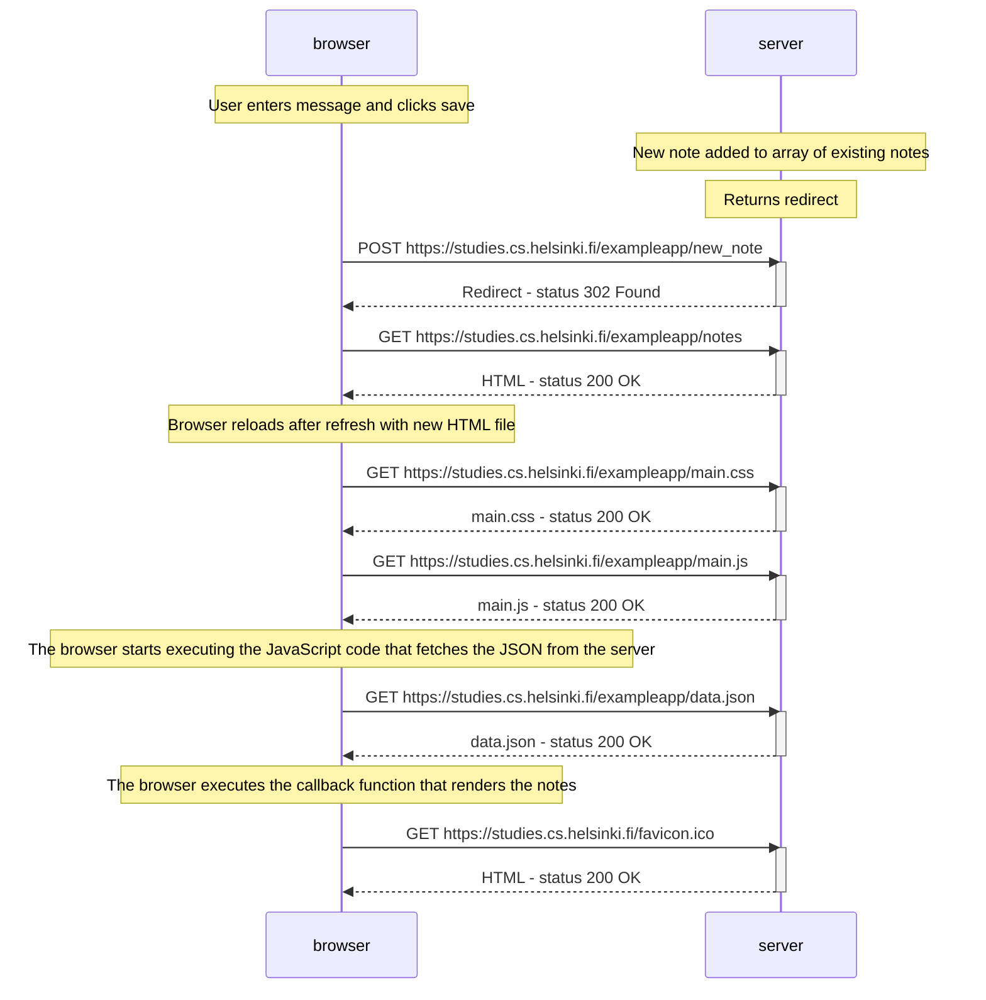

```mermaid
sequenceDiagram
    participant browser
    participant server
    
    Note over browser: User enters message and clicks save
    
    Note over server: New note added to array of existing notes
    
    Note over server: Returns redirect
    
    browser->>server: POST https://studies.cs.helsinki.fi/exampleapp/new_note
    activate server
    server-->>browser: Redirect - status 302 Found
    deactivate server

    browser->>server: GET https://studies.cs.helsinki.fi/exampleapp/notes
    activate server
    server-->>browser: HTML - status 200 OK
    deactivate server
    
    Note over browser: Browser reloads after refresh with new HTML file
    
    browser->>server: GET https://studies.cs.helsinki.fi/exampleapp/main.css
    activate server
    server-->>browser: main.css - status 200 OK
    deactivate server

    browser->>server: GET https://studies.cs.helsinki.fi/exampleapp/main.js
    activate server
    server-->>browser: main.js - status 200 OK
    deactivate server
    
    Note over browser: The browser starts executing the JavaScript code that fetches the JSON from the server
    
    browser->>server: GET https://studies.cs.helsinki.fi/exampleapp/data.json
    activate server
    server-->>browser: data.json - status 200 OK
    deactivate server
    
    Note over browser: The browser executes the callback function that renders the notes
    
    browser->>server: GET https://studies.cs.helsinki.fi/favicon.ico
    activate server
    server-->>browser: HTML - status 200 OK
    deactivate server

```    
    
